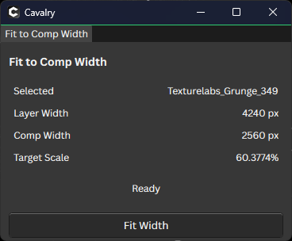
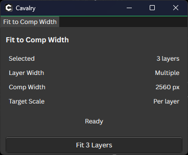

# Fit to Comp Width

A Cavalry script that scales selected layers proportionally to the width of the active composition. Its panel previews the layer width, composition width, and target scale for a single selection. You can fit several selected layers in one click.

| Single layer | Multiple layers |
| --- | --- |
|  |  |

## Install

1. Download [FitToCompWidth.jsc](https://github.com/MaxsonRichards/FitToCompWidth/releases/download/v1.0/FitToCompWidth.jsc) from the v1.0 release.
2. In Cavalry, open **Scripts > Show Scripts Folder** and copy `FitToCompWidth.jsc` into that folder.
3. Run **Scripts > FitToCompWidth** in Cavalry.

The editable source is [FitToCompWidth.js](FitToCompWidth.js).

## Use

Select one or more layers and click **Fit Width**. Each selected layer with a measurable width is scaled to match the composition width while keeping its current proportions. The panel shows the target scale for a single selected layer; for multiple layers, each is calculated separately.

## License

[MIT](LICENSE) © 2026 Maxson Richards.
